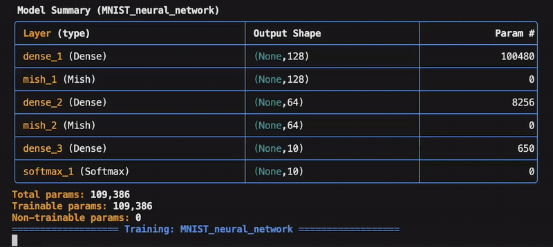
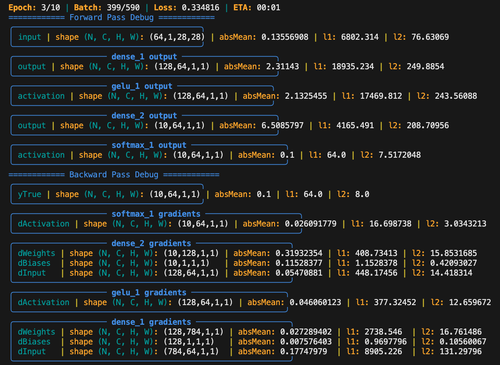
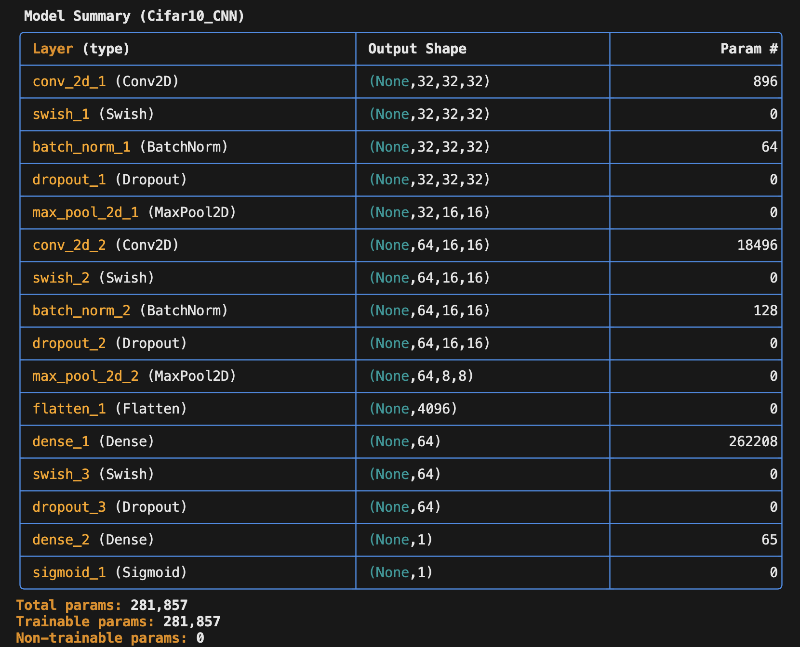

# JFlow  
**Note:** This library is deprecated. A new version is currently in development, featuring the same Java UI but a completely redesigned backend that uses JNI calls to native code, enabling GPU acceleration.  

**JFlow** is a memory-efficient deep learning library written in Java, designed for both educational use and real-world machine learning applications. It provides low-level control over model training and supports limited hardware.  

  

### Strengths  

#### 🧠 Memory Optimization  
- **Memory Options**: Train large models on large datasets with limited resources.  
    - Example: **CIFAR-10 CNN**, 1M parameters, < 2GB RAM (with image caching disabled)  
    - Example: **GPT-2 Small**, 124M parameters, < 9GB RAM for a sequence length of 512 (with gradient storage disabled)  
#### 🔍 Low-level Control & Debugging  
- Clean, Keras-similar UI for model training.  
- Implement custom training steps easily.  
- Debug mode for inspecting gradients.  
### Simple Neural Network Debug  
**Code**  
```java
Sequential model = new Sequential(
    "MNIST_neural_network",
    Dense(128, InputShape(FLAT_IMAGE_SIZE)),
    GELU(),
    Dense(NUM_CLASSES),
    Softmax()
).setDebug(true); // Enable full forward/backward tracing during training
```  
**Live Output**  
  

### Key Features  

#### Dataloader  
- Load images from CSV or directory.  
- Train-test-val-split and data batching.  

#### Transform  
- Normalize and augment images with built-in functions.  

#### Sequential Model  
  
- Build models with a simple UI.  
    - High-level functions: train, predict.  
    - Low-level functions: forward(data), backward(data).  
- Save and load model weights.  

#### Supported Layers  
- **Dense**  
- **Conv2D**  (Under development)  
- **MaxPool2D**  
- **GlobalAveragePooling2D**  
- **Upsampling2D**  
- **BatchNorm**  
- **LayerNorm**  
- **Flatten**  
- **Embedding**  
- **Dropout**  

#### Supported Activation Functions  
- **ReLU**, **LeakyReLU**, **Sigmoid**, **Tanh**, **Softmax**, **Swish**, **Mish**, **GELU**.  

#### FunctionalLayer  
- Build custom classes with internal JFlow layers. Easy to implement.  

#### Supported Optimizers  
- **SGD**, **AdaGrad**, **RMSprop**, **Adam**.  

#### Utilities  
- Plot images and confusion matrices.  
- JMatrix data type for low-level matrix operations.  

